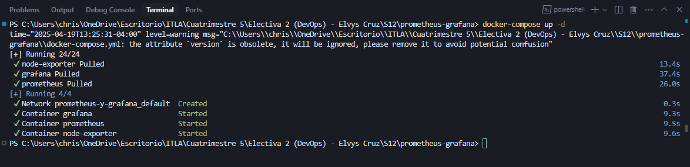
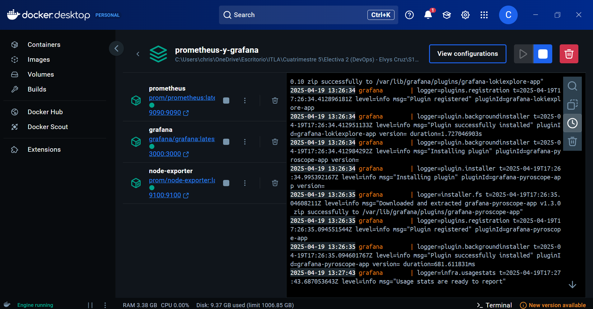
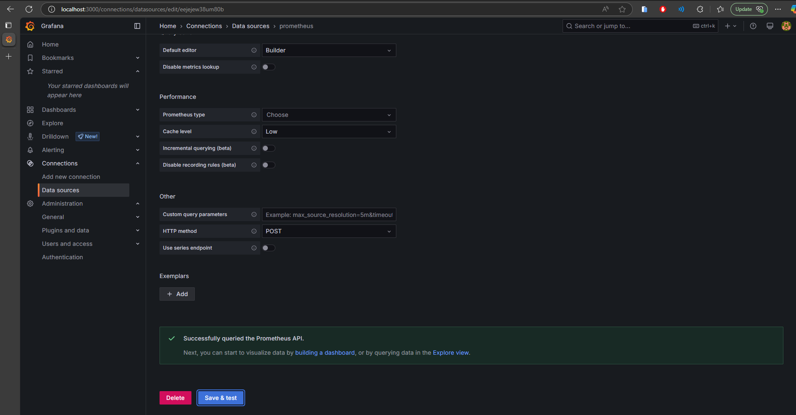
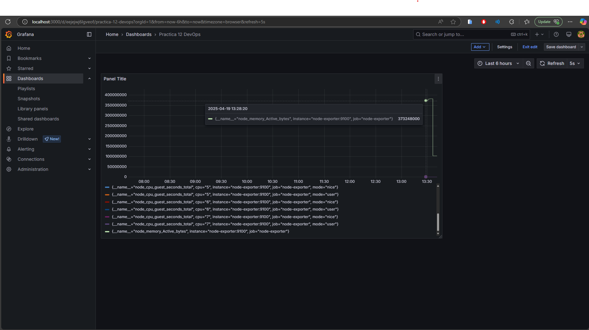

# 🐳 Prometheus y Grafana con Docker Compose

## 📝 Descripción
Este proyecto configura un entorno de monitoreo utilizando Prometheus y Grafana, orquestado con Docker Compose. Incluye:
- **Prometheus**: Para la recolección de métricas.
- **Grafana**: Para la visualización de métricas en dashboards.
- **Node Exporter**: Para exponer métricas del host (o del contenedor en este caso).

Este proyecto corresponde a la materia de Electiva 2 (DevOps) impartida por el profesor **Elvys Cruz**.

## 👤 Autor
- **Nombre:** Christian Gil
- **Matrícula:** 2012-1036

## 🚀 Instrucciones de Uso
1.  **Clonar el repositorio (si aplica):**
    ```bash
    git clone <URL_DEL_REPOSITORIO>
    cd <NOMBRE_DEL_DIRECTORIO>
    ```
2.  **Construir e iniciar los contenedores:**
    Asegúrate de tener Docker y Docker Compose instalados.
    ```bash
    docker-compose up -d
    ```
    Esto iniciará los servicios de Prometheus, Grafana y Node Exporter en segundo plano.

3.  **Acceder a los servicios:**
    *   **Prometheus**: Abre tu navegador y ve a `http://localhost:9090`
    *   **Grafana**: Abre tu navegador y ve a `http://localhost:3000`
        *   **Usuario:** admin
        *   **Contraseña:** admin (definida en `docker-compose.yml`)

4.  **Configurar Grafana (Opcional):**
    *   Inicia sesión en Grafana.
    *   Agrega Prometheus como fuente de datos (Data Source):
        *   **Tipo:** Prometheus
        *   **URL:** `http://prometheus:9090` (Grafana se comunica con Prometheus usando el nombre del servicio dentro de la red Docker)
    *   Importa o crea dashboards para visualizar las métricas (por ejemplo, dashboards para Node Exporter).

5.  **Detener los contenedores:**
    ```bash
    docker-compose down
    ```

## ⚙️ Configuración
-   **`docker-compose.yml`**: Define los servicios (Prometheus, Grafana, Node Exporter), volúmenes, puertos y redes.
-   **`prometheus.yml`**: Configuración de Prometheus, define los `scrape_configs` para recolectar métricas de sí mismo y de Node Exporter.

## 📸 Capturas de Pantalla
A continuación, se muestran capturas de pantalla de los servicios en funcionamiento:

1.  Prometheus Targets
    
2.  Grafana Login
    
3.  Grafana Data Source Configuration
    
4.  Grafana Dashboard Example
    

## 💡 Tecnologías Utilizadas


## 🙏 Créditos
Este proyecto fue desarrollado como parte de la materia de Electiva 2 (DevOps) impartida por el profesor **Elvys Cruz**.

## 📄 Licencia
Este proyecto se distribuye bajo la licencia MIT.


